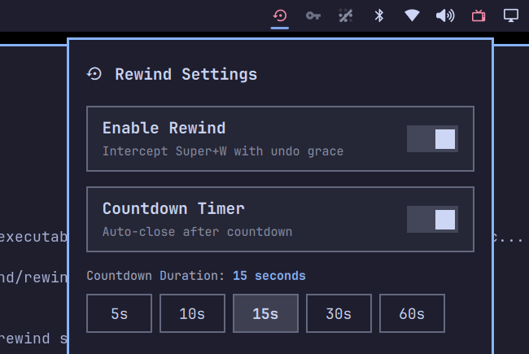

# Rewind Plugin for Omarchy

[](https://omarchy.org/)
[](LICENSE)
[](https://www.python.org/)

**Rewind** brings instant window undo and a configurable grace period to Omarchy and Hyprland.

Accidentally closed your browser, terminal with running tasks, or editor? Rewind catches the window and holds it in hidden memory so you can bring it back instantly in the exact same state—scroll positions, running processes, and unsaved buffers intact.

---

## Preview



---

## Highlights & Features

- **Instant Undo Grace Period**: Intercepts `Super + W` to softly move closed applications into dedicated hidden memory (`special:rewind`) without interrupting your desktop layout.
- **Full State Preservation**: Because windows are retained in memory during the grace period, all running tasks, unsaved drafts, tabs, and terminal sessions remain intact.
- **Grouped Windows**: Closing a grouped window saves only the selected member. The other members stay grouped on their workspace. The hidden tab keeps its original geometry so restoring it does not briefly expand over the group. Restore rejoins the original group at the same tab index, preserving its order and local lock. If original members disappeared, the saved window returns beside its surviving neighbours; if the group no longer exists or joining is refused, it restores separately in its original tiling or floating mode. If Hyprland refuses to detach the window (for example, when groups are globally locked), Rewind leaves it in place.
- **Two Operating Modes**:
  - **Countdown Timer Mode (Default)**: Automatically terminates the application after a customizable countdown (default: 15s).
  - **Manual Indefinite Mode**: Disables the timer. The closed application remains safely in hidden memory until you restore it (`Super + U`) or close another window (which terminates the previous one and takes its place).
- **Interactive Bar Widget & Settings Menu**: Click the status bar icon or press `Super + Shift + U` to open the settings popup. Adjust grace periods (5s, 10s, 15s, 30s, 60s), switch modes, or view remaining time.
- **Smart Media Auto-Pause & Resume**: Automatically detects if audio or video is playing in the window via MPRIS D-Bus (YouTube, Spotify, browser video tabs, media players). Silently pauses playback when hidden into grace memory, and seamlessly resumes when restored.
- **Audio Stream Mute & State Isolation**: Windows hidden in the grace period have their PipeWire and PulseAudio streams temporarily muted. If restored, audio is instantly unmuted. If the window permanently closes, audio links are severed and unmuted prior to exit, preventing WirePlumber or PulseAudio from persisting a muted state on future application launches.
- **Reliable Multi-Phase Termination**: When grace expires, windows are cleanly closed via compositor dispatch, with automatic fallback to compositor force-kill and descendant process tree cleanup (SIGTERM with a generous 3.0s graceful shutdown window, followed by SIGKILL only if deadlocked/hung), preventing orphaned background processes without rushing data saves.
- **Native Omarchy OSD**: Displays native on-screen notifications when closing, rewinding, or toggling modes.
- **Zero Background Resource Overhead**: Ultra lightweight Python 3 architecture using only standard library modules and file locking. No persistent background daemons when idle (<0.1% CPU).

---

## Installation

### 1. Install and enable the plugin:

```bash
omarchy plugin add https://github.com/Andrewx82/omarchy-rewind.git --enable
```

### 2. Enable Hyprland shortcuts (`Super + W`, `Super + U`):

Choose either method:
- **1-Click via Bar Widget**: Click the Rewind icon on your status bar and click **Enable** on the shortcuts banner.
- **1-Command via Terminal**: Run `rewind setup`.
- **Manual Config**: Add the keybinding snippet below to `~/.config/hypr/bindings.lua`.

---

## Hyprland Keybindings

To enable the keyboard shortcuts, add the following bindings to your configuration:

### Omarchy Quattro (`~/.config/hypr/bindings.lua`)

```lua
-- Rewind: Window grace period and instant undo
o.bind("SUPER + W", "Close window (Rewind grace)", "rewind close")
o.bind("SUPER + U", "Rewind closed window", "rewind restore")
o.bind("SUPER + CTRL + U", "Toggle Rewind", "rewind toggle")
o.bind("SUPER + ALT + W", "Toggle Rewind", "rewind toggle")
o.bind("SUPER + SHIFT + U", "Rewind settings menu", "rewind menu")
```

### Standard Hyprland (`~/.config/hypr/hyprland.conf`)

```ini
# Rewind: Window grace period and instant undo
bind = SUPER, W, exec, rewind close
bind = SUPER, U, exec, rewind restore
bind = SUPER CTRL, U, exec, rewind toggle
bind = SUPER ALT, W, exec, rewind toggle
bind = SUPER SHIFT, U, exec, rewind menu
```

---

## CLI Reference

The `rewind` utility can be controlled directly from the terminal or your own scripts:

| Command | Description |
|---|---|
| `rewind close` | Soft-close active window with Rewind grace period |
| `rewind restore` | Restore / rewind the last closed window to its workspace |
| `rewind toggle` | Toggle Rewind ON / OFF with native OSD |
| `rewind menu` | Open or toggle the settings popup on the status bar |
| `rewind clear` | Permanently terminate all hidden windows and clear queue |
| `rewind config --duration <sec>` | Set countdown grace duration (e.g. `rewind config --duration 30`) |
| `rewind config --disable-countdown` | Switch to manual indefinite memory mode |
| `rewind config --enable-countdown` | Switch to countdown timer mode |
| `rewind config --toggle-countdown` | Toggle between timer and manual modes |
| `rewind config --toggle-media` | Toggle auto-pausing playing media ON / OFF |
| `rewind setup` | Configure Hyprland shortcuts in ~/.config/hypr/bindings.lua |
| `rewind remove-bindings` | Remove shortcuts from bindings.lua and restore Omarchy defaults |
| `rewind uninstall` | Completely uninstall Rewind and restore Omarchy defaults |
| `rewind status` | Output JSON state for status bars and scripts |

---

## Updating & Removal

### Update

To update Rewind to the latest version:

```bash
omarchy plugin update omarchy-rewind --yes
```

### Clean Uninstall

To completely uninstall Rewind, automatically restore your default Omarchy shortcuts (`Super + W` -> standard close), and clean up all symlinks and state:

```bash
rewind uninstall
```

### Restore Default Shortcuts Only

If you want to keep the Rewind plugin installed but switch back to default Omarchy shortcuts:
- **Via Status Bar**: Click the Rewind icon on your status bar and click **Restore Defaults**.
- **Via Terminal**: Run:
  ```bash
  rewind remove-bindings
  ```
To re-enable Rewind shortcuts at any time, run `rewind setup` or click **Enable** in the status bar menu.

---

## Dependencies & Requirements

- **Omarchy** with Omarchy Shell & Quickshell
- **Hyprland** (tested on 0.54.0+)
- **Python 3.10+** (Standard library only; zero external pip dependencies required)
- Utilities: `hyprctl`, `omarchy-shell`

---

## Tests

Run the regression tests with Python's standard library (no running desktop required):

```bash
python -m unittest discover -s tests -v
```

## License

This project is licensed under the [MIT License](LICENSE).
